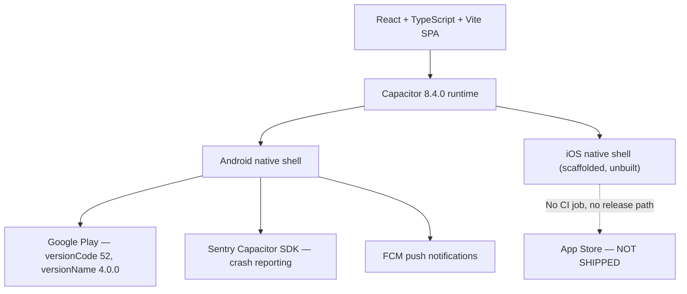
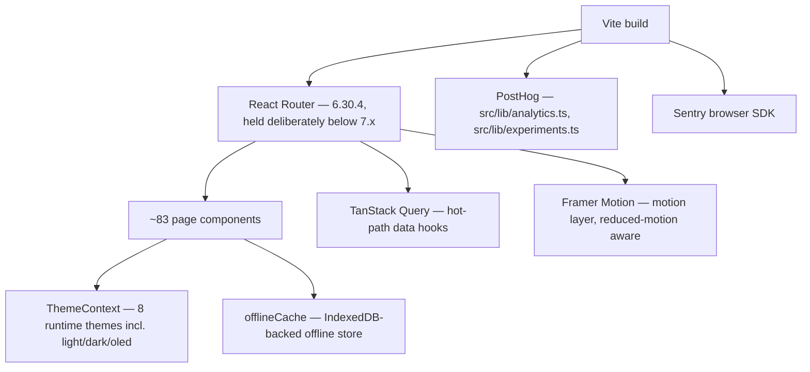
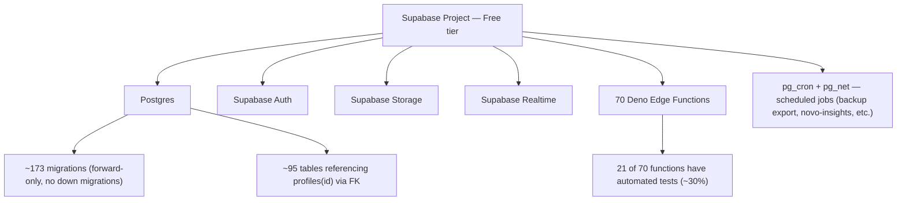
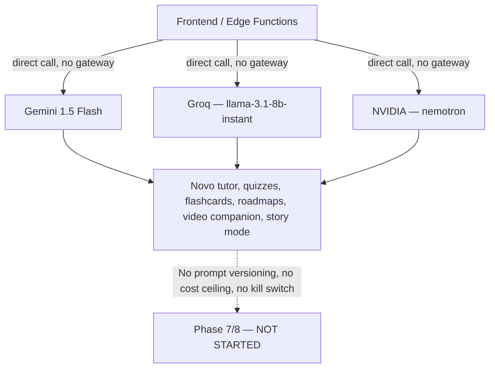
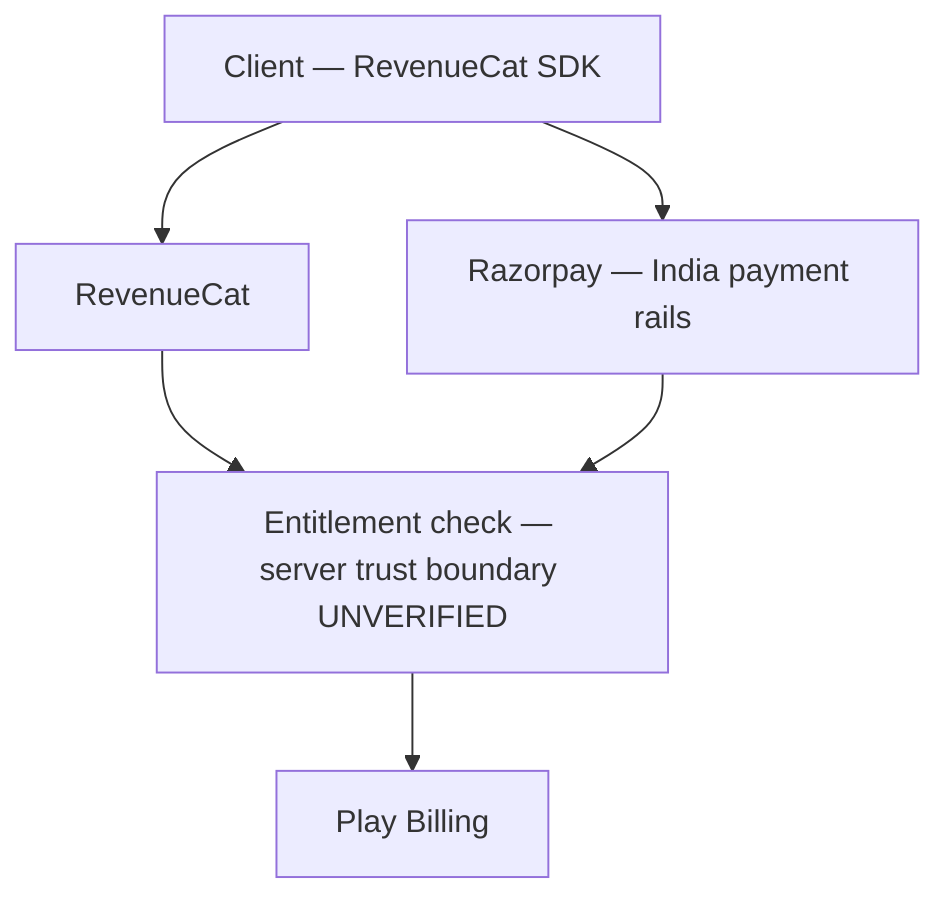
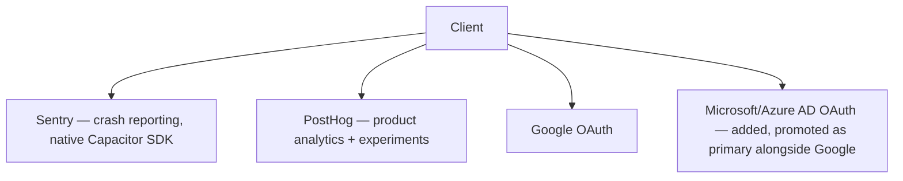
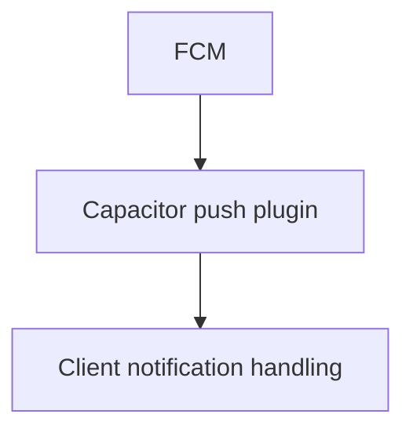
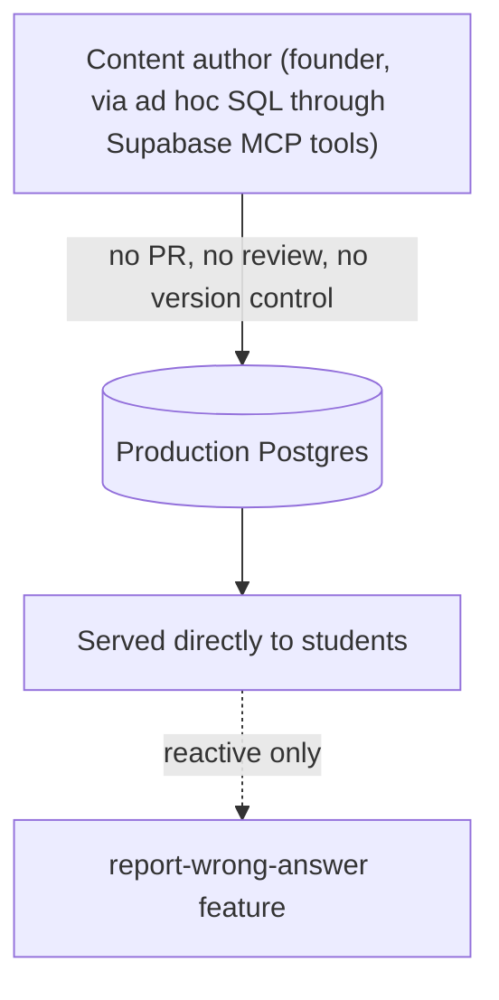
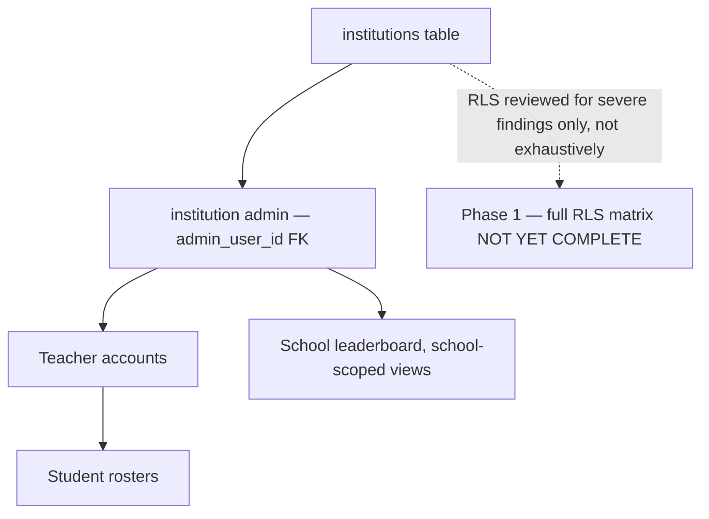

# Edora — Current-State Architecture

**Status:** Phase 0 baseline, built from direct repository inspection (package.json, Capacitor config, Supabase functions directory, CI workflows, docs) on commit `d4bc558`, 2026-08-06. Not aspirational — this reflects what exists today, including known gaps.

## 1. Mobile client

**Known gap:** iOS project directory (`ios/App`) exists but has zero CI coverage and no verified build. It must not be described as "existing iOS support" without a passing CI job and a real build artifact — currently neither exists.

## 2. Frontend application layer

## 3. Backend — Supabase

**Known gap:** Free tier means no point-in-time recovery from the vendor — only the daily `db-backup-export` snapshot built this session (RPO ~24h, restore unproven as a full drill — see `RISK_REGISTER.md` RISK-002/003).

## 4. AI provider layer (no gateway — direct calls today)

**Known gap:** ~42 confirmed direct AI-provider call sites across Edge Functions. No central gateway, no token/cost tracking, no per-user quota, no graceful degradation on provider outage.

## 5. Payments and entitlements

**Known gap:** Server-side verification, webhook idempotency, and entitlement reconciliation have not been audited (Phase 10, not started).

## 6. Analytics, crash reporting, and OAuth

## 7. Push notifications

**Known gap:** No push delivery-rate or failure observability exists yet (Phase 9).

## 8. Content pipeline (current — informal)

**This is the honest current state, not the target.** Phase 12 replaces this with Draft → Validation → Review → Approved → Published → Reported → Corrected → Retired.

## 9. Institution access (current)

**Known state:** one real, live institution customer exists. `institutions.admin_user_id` was `RESTRICT` + `NOT NULL` until this session's fix (now `SET NULL` + nullable) — that specific bug is resolved and live-tested. Broader cross-tenant isolation guarantees beyond that fix have not been exhaustively verified.

## 10. Deployment surfaces (from `docs/rollback-procedure.md`, verified referenced, not re-verified live in Phase 0)

| Surface | Host | Rollback mechanism |
|---|---|---|
| Web app | Firebase Hosting (`edora-bb02e`) | Release history + `firebase hosting:rollback` |
| Android | Google Play Console | No downgrade support — staged rollout percentage is the real control |
| Database | Supabase Postgres | Forward-only migrations; corrective migration or backup restore only |
| Edge Functions | Supabase | Git history is the safety net, not a platform feature |
| Marketing site | Vercel (`edora-website` repo, separate) | Git-connected auto-deploy |

## What this document does not yet cover

- No sequence diagrams for individual user flows (mock exam submission, account deletion, etc.) — those belong to their respective phases (5, 2).
- No network/infra diagram for Supabase's own internal topology — not accessible from this repository.
- No cost model overlay — that is Phase 7/11 work.

**Last updated:** Phase 0 baseline, commit `d4bc558`.
